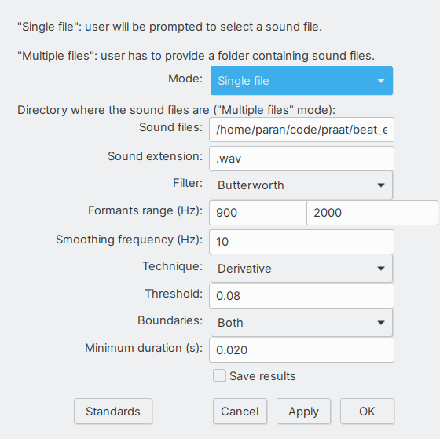

# vowel-detector.praat

Praat script to find onsets and offsets of vowel-like segments in a sound file based on its energy profile. 

Cummins (1998) describes a procedure based on Scott (1993) to identify what he calls syllabic beats, or the time points in the speech chain where listeners seem to anchor the perception of the succession of vowel sounds, an idea that can be likened to the concept of p-centers. Research has established that these beats are highly associated with the onset of vowel sounds.

The procedure outlined by Cummins consists of the following steps:

1. Take the acoustic signal and apply a band pass filter that keeps most of the energy in the range of vowel formants and eliminates both low frequency energy (associated with f0) and fricative noise.

2. Rectify  the filtered signal.

3. Heavily smooth the rectified signal by applying a low pass filter to generate a smooth amplitude envelope that we call beat wave. Rises and falls in the beat wave roughly coincide with onsets and offsets of vowel and vowel-like sounds.

4. A local rise in the beat wave is considered a beat and the location is defined to be at the point midway between 10% and 90% of the total rise amplitude.  

Cummins hasn't made his code publicly available. Barbosa shares his Praat implementation called [BeatExtractor](https://github.com/pabarbosa/prosody-scripts). Barbosa introduced an alternative criterion to define beat location: beat location was defined by taking the first derivative of the beat wave and finding the local maxima in it. This option was added alongside Cummins original amplitude criterion.

The present script is a complete rewrite of Barbosa's script. The main difference is that our implementation only offers the beat wave derivative criterion and identifies vowel offsets as well as onsets. Offsets are defined as the local minima in the beat wave derivative contour. Also, we mostly use Praat's own built-in functions to make the code a little faster and more readable and concise.

## Purpose

Identify onsets and offsets of vowel-like segments in WAV files.

## Input

A WAV sound file.

The script can handle single files or process all files in a given directory.

## Output

The script generates two objects:

- A two-channel Sound object: one has the input sound wave and the other the associated beatwave.
- A TextGrid file where vowel onsets and/or offsets time locations are marked as boundaries in a boundary tier.

Selecting both objects and pressing the `View & Edit` button on the dynamic menu the user will see something like the following figure ("V" labels were added manually to better show the vowel regions detected by the script). 

## Parameters

Upon running the script, a window like the one below will appear, where the user has to set a number of parameters.

The parameters are:

- **Mode**: .
- **Filter**: choice of filter.
- ****: define lower and upper band to be used in the band-pass filter.
- **Smoothing frequency**: beat wave smoothing frequency
- **Threshold**: a maximum or minimum in the beat wave derivative will be considered an onset or offset if it has at least this value.
- **Boundaries**: defines if onsets, offsets or both will be detected.
- **Mininum duration**: onset of offset events have to be at least this amount of time apart to be set in the output TextGrid.
- **Save results**: if selected, script output (TextGrid and beatwave sound file) will be saved to the same folder where the script is run from.

## Comments

Script file and user files don't need to be in the same file directory.

## License

See the [LICENSE](LICENSE.md) file for license rights and limitations.

## Cite as

## References

Cummins, F., and Port, R. (1998). Rhythmic constraints on stress timing in English. _Journal of Phonetics_, 26, 145–171.

Scott, S. K. (1993). P-centers in speech: an acoustic analysis. University College London.
